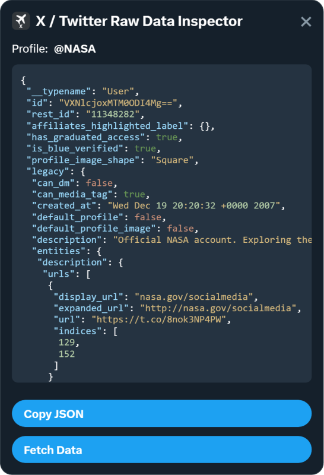

# X / Twitter Raw Data Inspector

[](https://github.com/TAbdiukov/twitter-raw-data-extension)
[](https://chromewebstore.google.com/detail/ndihhakhboijbhmoilphcnbmbjdiinfa?utm_source=item-share-cb)

[](https://buymeacoffee.com/tabdiukov)

 | 
---- |

A tiny Chrome (Manifest V3) extension that overlays a panel on X / Twitter profile pages and shows the **raw GraphQL user payload** (“UserByScreenName”). It’s handy for debugging, scraping pipelines, data audits, or just learning what the site’s API returns for a given profile. 

Made by Tim Abdiukov

---

## Installation

The extension is now available through the official distribution channels for both Chrome and Firefox.
For most users, installing from these official sources is the easiest and most reliable option.
Just visit the extension's page in the Chrome Web Store or Firefox Add-ons and add it to your browser.

### Manual Installation (for development or local testing)

1. Clone or download this repository.
2. Open Chrome and navigate to `chrome://extensions/`.
3. Toggle **Developer mode** (top right).
4. Click **Load unpacked** and select the project folder.
5. Visit any X profile (e.g., `https://x.com/<username>`) and look for the panel in the top‑right corner.

---

## Features

* ✅ Auto‑detects profile / tweet pages and injects the panel
* ✅ One‑click **Fetch Data**
* ✅ Inline **syntax highlighting** (strings, numbers, booleans, nulls, keys)
* ✅ **Copy JSON** button (with success/failure feedback)
* ✅ SPA‑navigation aware (watches route changes and re‑inits when you move around X)
* ✅ Basic keyboard support: focus the code area and press **Cmd/Ctrl + A** to select all

---

## Usage

1. Login to X/Twitter as usual
2. Open any profile on **x.com** or **twitter.com** (e.g., `https://x.com/username`).
3. In the top‑right, find **“X / Twitter Raw Data Inspector”**.
4. Click **Fetch Data**.

   * On success, the JSON appears with syntax highlighting.
   * Click **Copy JSON** to copy it to your clipboard.
5. Click **✖** to hide the panel.

**Keyboard tip:** The JSON box is focusable. Press **Cmd+A** (macOS) or **Ctrl+A** (Windows/Linux) to select all JSON for quick copy.

---

## What you get (example)

A typical response has this general form (trimmed for brevity):

```json
{
  "id": "…",
  "rest_id": "…",
  "is_blue_verified": true,
  "legacy": {
    "name": "Display Name",
    "screen_name": "username",
    "location": "…",
    "description": "…",
    "followers_count": 123,
    "friends_count": 456,
    "created_at": "…",
    "statuses_count": 789
  }
}
```

The actual fields depend on what the site exposes and may change over time.

---

## Security & privacy

* Your **`auth_token`** and **`ct0`** are sensitive. This extension uses them only to authenticate a request **to X / Twitter**. They are not sent anywhere else by this code.
* Do **not** share captured JSON if it contains identifiers you consider private.
* Audit the code yourself before use in sensitive environments. Use at your own risk and comply with the platform’s terms and local laws.

This project is unaffiliated with X / Twitter. Use responsibly and follow the platform’s Terms of Service.

---------------------------------

Tim Abdiukov
